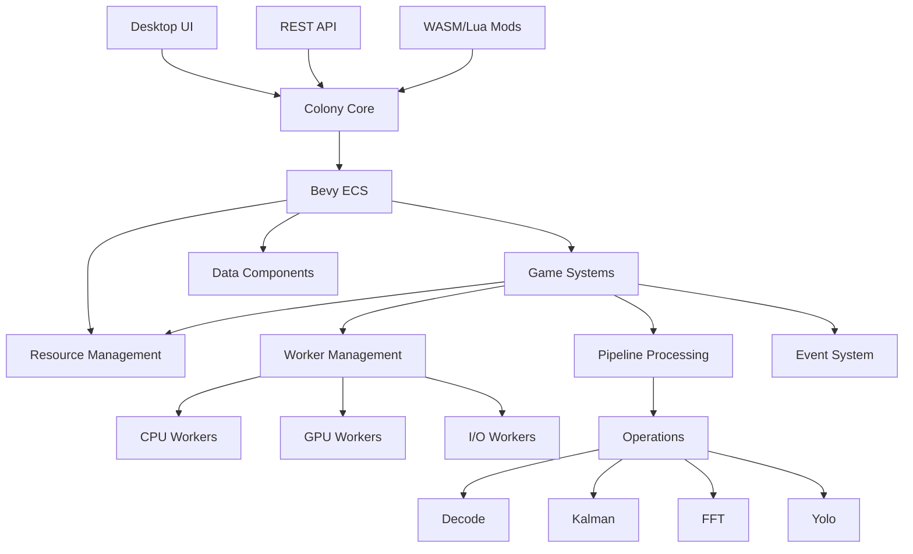
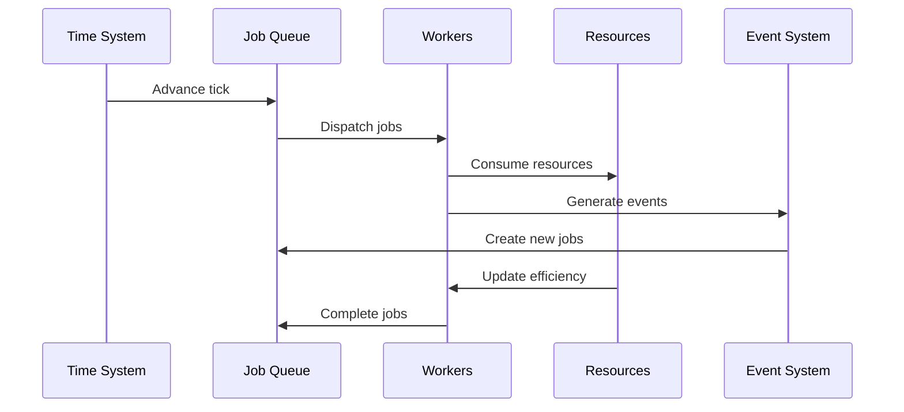
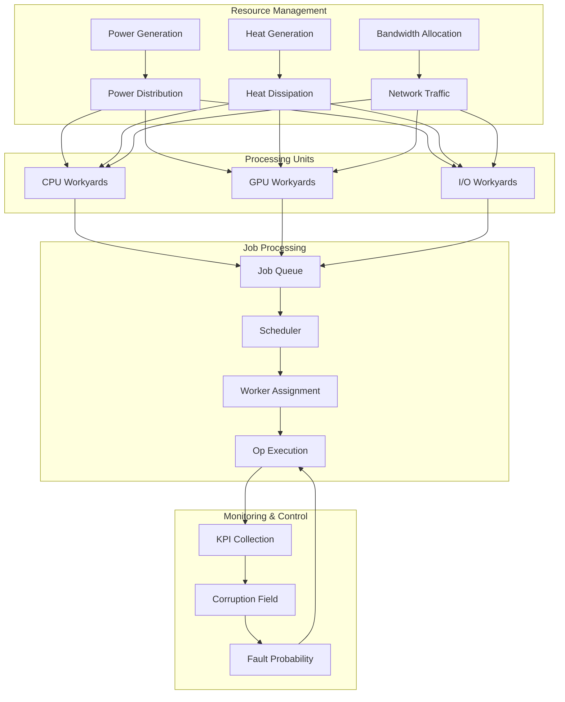
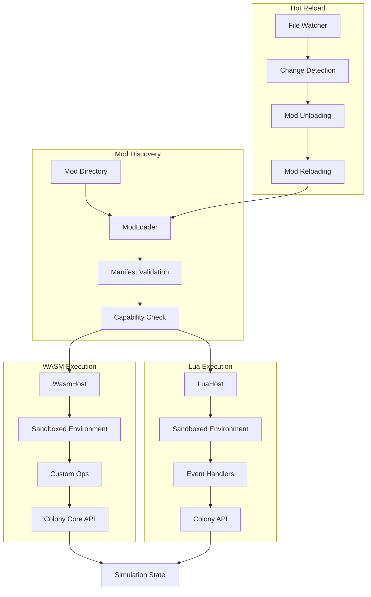
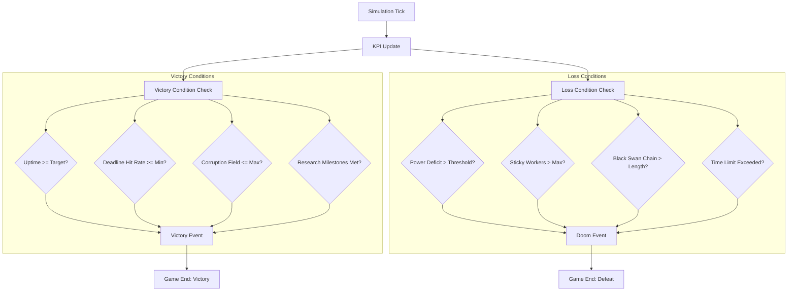
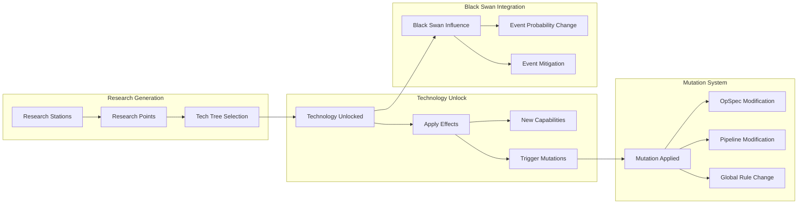
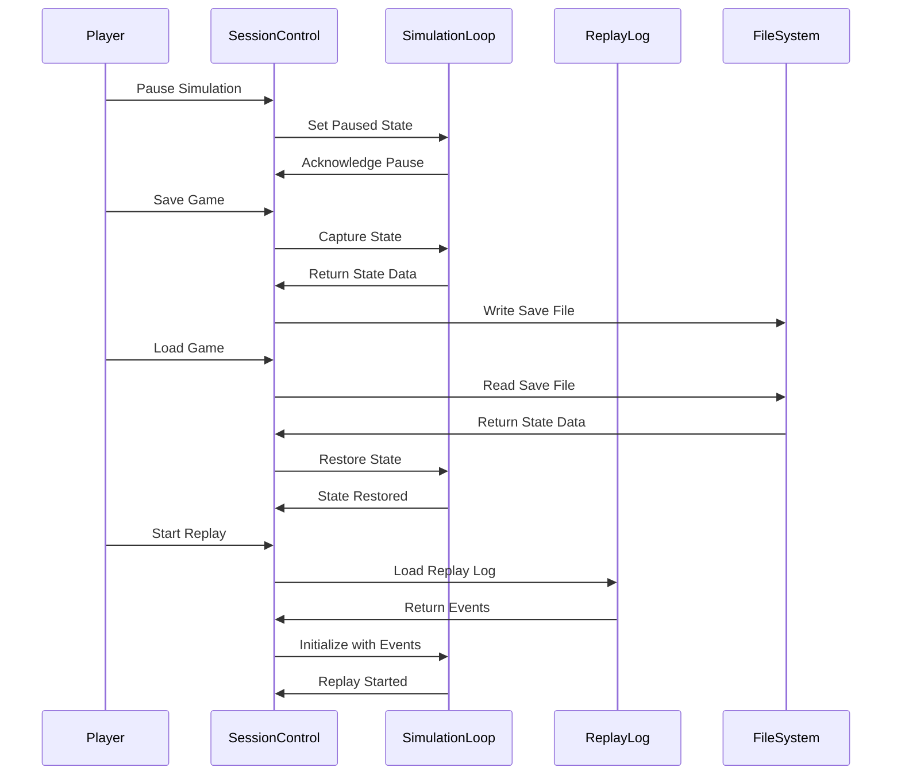

# Developer Docs: Architecture Overview

This document provides a comprehensive overview of the Colony Simulator's architecture, design principles, and implementation details.

## 🏗️ System Architecture

### High-Level Overview

The Colony Simulator is built on a modern, modular architecture using Rust and the Bevy ECS (Entity Component System) framework. The system is designed for performance, maintainability, and extensibility.



### Core Components

#### 1. Colony Core (`colony-core`)
The heart of the simulation engine, containing:
- **ECS Systems**: Game logic and simulation systems
- **Components**: Data structures for entities
- **Resources**: Global state management
- **Events**: Inter-system communication
- **Modding Runtime**: WASM and Lua execution environments

#### 2. Desktop Application (`colony-desktop`)
The graphical user interface built with Bevy's UI system:
- **Dashboard**: Real-time system monitoring
- **Controls**: Simulation management
- **Visualization**: Charts and graphs
- **Settings**: Configuration management

#### 3. Headless Server (`colony-headless`)
REST API server for programmatic access:
- **HTTP Endpoints**: RESTful API for external control
- **Session Management**: Simulation state management
- **Metrics Export**: Performance data export
- **Mod Management**: Remote mod control

#### 4. Modding SDK (`colony-modsdk`)
Development tools and APIs for mod creation:
- **WASM ABI**: WebAssembly interface definitions
- **Lua API**: Lua scripting interface
- **CLI Tools**: Command-line mod management
- **Documentation**: Modding guides and references

## 🎮 ECS Architecture

### Entity Component System

The Colony Simulator uses Bevy's ECS for efficient, data-oriented design:

#### Entities
- **Workers**: Individual processing units
- **Workyards**: Facilities housing workers
- **Jobs**: Data processing tasks
- **Events**: System events and notifications

#### Components
- **Worker**: Worker state and capabilities
- **Workyard**: Facility properties and status
- **Job**: Task definition and progress
- **Transform**: Spatial positioning (for visualization)

#### Resources
- **Colony**: Global colony state
- **JobQueue**: Pending job management
- **FaultKpi**: Fault tracking and metrics
- **ResearchState**: Research progress and unlocks
- **ModLoader**: Mod management and execution

#### Systems
- **Update Systems**: Core simulation logic
- **Rendering Systems**: UI and visualization
- **Event Systems**: Event processing and handling
- **Mod Systems**: Mod execution and management

### System Organization

```rust
// Core simulation systems
app.add_systems(Update, (
    time_system,
    power_bandwidth_system,
    heat_system,
    corruption_system,
    dispatch_system,
    gpu_dispatch_system,
    report_ingest_system,
    maintenance_system,
    update_fault_kpis,
    apply_debts_system,
    update_kpi_buffer_system,
    black_swan_scan_system,
    mutation_commit_system,
    research_progress_system,
    update_sla_window,
    win_loss_system,
    session_control_system,
));

// Modding systems
app.add_systems(Update, (
    update_wasm_host_system,
    update_lua_host_system,
    execute_lua_events_system,
    initialize_mod_loader_system,
    process_hot_reload_system,
    update_shadow_world_system,
));
```

## 🔄 Data Flow

### Simulation Loop

The simulation runs in discrete ticks, with each tick representing a fixed time interval:



### Pipeline Processing

Data flows through processing pipelines:

1. **Input**: Raw data packets arrive
2. **Demux**: Packets are routed to appropriate pipelines
3. **Processing**: Data is transformed through operations
4. **Output**: Processed data is sent to destinations
5. **Metrics**: Performance data is collected

### Resource Management

Resources are managed through a centralized system:

- **Power**: Global power consumption and capacity
- **Heat**: Per-workyard heat generation and dissipation
- **Bandwidth**: Network utilization and capacity
- **Corruption**: System-wide degradation tracking

## 🎯 Key Systems

### Worker Management

Workers are the core processing units of the colony:

```rust
#[derive(Component)]
pub struct Worker {
    pub id: u32,
    pub class: WorkClass,
    pub skill_cpu: f32,
    pub skill_gpu: f32,
    pub skill_io: f32,
    pub discipline: f32,
    pub focus: f32,
    pub corruption: f32,
    pub state: WorkerState,
    pub retry: RetryPolicy,
    pub sticky_faults: u32,
}
```

#### Worker States
- **Idle**: Available for work
- **Running**: Currently processing a job
- **Faulted**: Experiencing errors
- **Maintenance**: Undergoing repair

#### Worker Classes
- **CPU**: General-purpose processing
- **GPU**: Parallel processing
- **I/O**: Input/output operations

### Pipeline System

Pipelines define how data is processed:

```rust
#[derive(Component, Clone)]
pub struct Pipeline {
    pub ops: Vec<Op>,
    pub mutation_tag: Option<String>,
}
```

#### Operations
- **UDP Demux**: Network packet processing
- **HTTP Parse**: Web request handling
- **Decode**: Data decompression
- **Kalman**: Signal processing
- **FFT**: Frequency analysis
- **Yolo**: AI inference (GPU only)

### Fault System

The fault system models real-world system failures:

```rust
#[derive(Resource)]
pub struct FaultKpi {
    pub soft_faults: u64,
    pub sticky_faults: u64,
    pub sticky_workers: u32,
    pub retry_success_rate: f32,
}
```

#### Fault Types
- **Transient**: Temporary failures that resolve automatically
- **Sticky**: Persistent failures requiring intervention
- **Cascading**: Failures that trigger additional failures

### Research System

The research system allows colonies to unlock new capabilities:

```rust
#[derive(Resource)]
pub struct ResearchState {
    pub points: u32,
    pub acquired_techs: HashSet<String>,
    pub available_techs: Vec<String>,
}
```

#### Research Categories
- **Efficiency**: Worker performance improvements
- **Reliability**: Fault tolerance enhancements
- **Capacity**: Resource limit increases
- **Operations**: New processing capabilities

## 🔧 Modding Architecture

### WASM Host

WebAssembly mods are executed in a sandboxed environment:

```rust
#[derive(Resource)]
pub struct WasmHost {
    pub modules: HashMap<String, WasmModule>,
    pub execution_env: ExecutionEnv,
}
```

#### Execution Environment
- **Fuel Limits**: Prevent infinite loops
- **Memory Limits**: Control memory usage
- **Sandbox Mode**: Restrict system access
- **Capability Gating**: Control mod permissions

### Lua Host

Lua scripts provide event-driven scripting:

```rust
#[derive(Resource)]
pub struct LuaHost {
    pub scripts: HashMap<String, LuaScript>,
    pub execution_env: ExecutionEnv,
}
```

#### Execution Environment
- **Instruction Budget**: Limit execution time
- **Memory Limits**: Control memory usage
- **Sandbox Mode**: Restrict system access
- **Capability Gating**: Control script permissions

### Hot Reload System

Mods can be reloaded without restarting the simulation:

```rust
#[derive(Resource)]
pub struct HotReloadManager {
    pub watchers: HashMap<String, ModWatcher>,
    pub pending_reloads: HashSet<String>,
    pub reload_cooldown: Duration,
}
```

#### Hot Reload Features
- **File Watching**: Automatic detection of mod changes
- **Atomic Updates**: Safe mod replacement
- **Rollback**: Revert to previous version on failure
- **Cooldown**: Prevent excessive reloading

## 📊 Performance Considerations

### Optimization Strategies

#### ECS Benefits
- **Data Locality**: Components are stored contiguously
- **Cache Efficiency**: Better CPU cache utilization
- **Parallel Processing**: Systems can run in parallel
- **Memory Efficiency**: Reduced memory fragmentation

#### System Design
- **System Splitting**: Break large systems into smaller ones
- **Resource Sharing**: Minimize resource conflicts
- **Event Batching**: Group related events together
- **Lazy Evaluation**: Compute values only when needed

### Scalability

#### Horizontal Scaling
- **Worker Distribution**: Spread workers across multiple workyards
- **Load Balancing**: Distribute work evenly
- **Resource Pooling**: Share resources across systems
- **Fault Isolation**: Prevent failures from spreading

#### Vertical Scaling
- **Resource Optimization**: Maximize resource utilization
- **Performance Tuning**: Optimize system performance
- **Memory Management**: Efficient memory usage
- **CPU Optimization**: Maximize CPU efficiency

## 🛡️ Security Architecture

### Sandboxing

#### WASM Sandboxing
- **Memory Isolation**: Separate memory spaces
- **Fuel Limits**: Prevent infinite loops
- **Capability Gating**: Control system access
- **Content Signing**: Verify mod authenticity

#### Lua Sandboxing
- **Instruction Limits**: Control execution time
- **Memory Limits**: Control memory usage
- **Function Restrictions**: Limit available functions
- **Capability Gating**: Control system access

### Security Measures

#### Mod Validation
- **Manifest Validation**: Verify mod structure
- **Capability Checking**: Ensure proper permissions
- **Content Verification**: Check mod integrity
- **Signature Validation**: Verify mod authenticity

#### Runtime Security
- **Execution Monitoring**: Monitor mod execution
- **Resource Limits**: Enforce resource constraints
- **Fault Isolation**: Prevent mod failures from affecting system
- **Rollback Capability**: Revert problematic changes

## 🔄 Testing Architecture

### Test Organization

#### Unit Tests
- **Component Tests**: Test individual components
- **System Tests**: Test individual systems
- **Resource Tests**: Test resource management
- **Utility Tests**: Test helper functions

#### Integration Tests
- **End-to-End Tests**: Test complete workflows
- **API Tests**: Test REST API endpoints
- **Mod Tests**: Test mod execution
- **Performance Tests**: Test system performance

#### Property Tests
- **Determinism Tests**: Verify deterministic behavior
- **Invariant Tests**: Verify system invariants
- **Stress Tests**: Test under extreme conditions
- **Regression Tests**: Prevent regressions

### Test Infrastructure

#### Test Harness
- **Test Runner**: Automated test execution
- **Test Data**: Synthetic test data generation
- **Test Environment**: Isolated test environment
- **Test Reporting**: Test result reporting

#### CI/CD Integration
- **Automated Testing**: Run tests on every commit
- **Performance Monitoring**: Track performance over time
- **Quality Gates**: Prevent low-quality code
- **Release Validation**: Validate release candidates

## 📚 Next Steps

Now that you understand the architecture:

1. **Explore**: Dive into specific system implementations
2. **Contribute**: Add new features or improvements
3. **Mod**: Create custom mods using the SDK
4. **Optimize**: Improve system performance

The architecture is designed to be extensible and maintainable. Whether you're adding new features, optimizing performance, or creating mods, the modular design should support your needs.

## 🔄 System Interaction Diagrams

### Resource Flow Architecture



### Modding System Architecture



### Victory/Loss Condition Evaluation



### Research and Mutation System



### Session Control and Replay System



---

**Ready to build on this foundation?** 🏗️⚡
