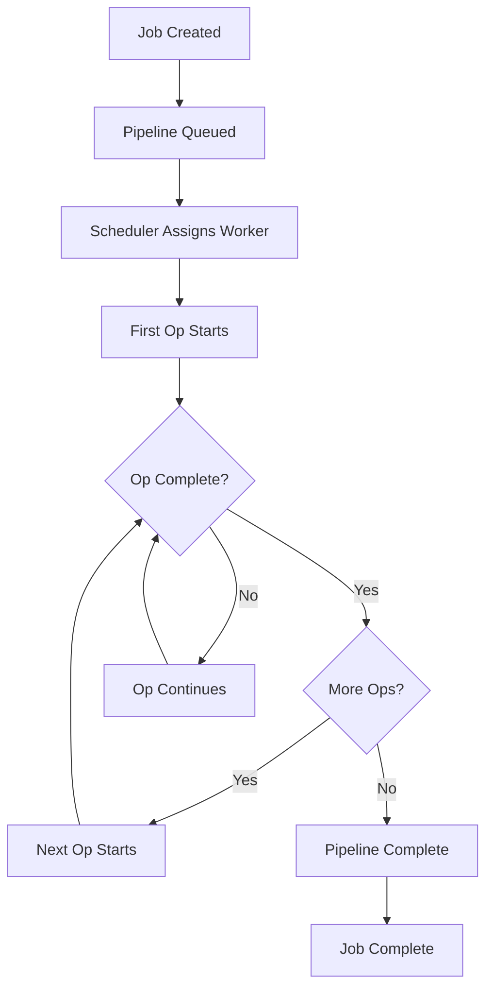

# Developer Docs: Operations & Pipelines

Operations (Ops) and Pipelines are the fundamental building blocks of work in the Colony Simulator. This document explains how they work, how to create new ones, and how they integrate with the simulation.

## Overview

### Operations (Ops)

An **Operation** is a single unit of work that can be performed by a worker. Each operation has:

- **Resource Requirements**: CPU, GPU, I/O, and time costs
- **Input/Output**: Data that flows through the operation
- **Behavior**: What the operation actually does
- **Metadata**: Name, description, and other properties

### Pipelines

A **Pipeline** is a sequence of operations that must be executed in order. Pipelines represent complete workflows or job types in the simulation.

## Core Concepts

### Resource Requirements

Every operation consumes resources:

```rust
pub struct OpResourceCost {
    pub cpu: f32,        // CPU cycles required
    pub gpu: f32,        // GPU compute units required
    pub io: f32,         // I/O operations required
    pub time: f32,       // Time in ticks
    pub memory: f32,     // Memory in bytes
    pub bandwidth: f32,  // Network bandwidth in bytes
}
```

### Operation Types

The simulation supports several built-in operation types:

#### CPU Operations
- **Decode**: Decode encoded data
- **Encrypt**: Encrypt data
- **Analyze**: Analyze data patterns
- **Compress**: Compress data
- **Decompress**: Decompress data

#### GPU Operations
- **Render**: Render graphics or compute
- **Process**: GPU-accelerated processing
- **Transform**: Transform data using GPU

#### I/O Operations
- **Read**: Read data from storage
- **Write**: Write data to storage
- **Network**: Send/receive network data
- **Route**: Route data between systems

### Pipeline Definition

Pipelines are defined in TOML configuration files:

```toml
[pipelines.video_stream]
name = "Video Stream Processing"
description = "Process incoming video streams"
qos = "latency"  # or "throughput"
deadline = 100   # ticks

[pipelines.video_stream.ops]
# Operation sequence
ops = [
    { type = "Decode", cpu = 10.0, time = 5.0 },
    { type = "Analyze", cpu = 15.0, time = 8.0 },
    { type = "Render", gpu = 20.0, time = 12.0 },
    { type = "Write", io = 5.0, time = 3.0 }
]
```

## Implementation Details

### Operation Execution

Operations are executed by workers in the simulation:

```rust
pub struct OpExecution {
    pub op_id: OpId,
    pub worker_id: WorkerId,
    pub start_tick: u64,
    pub end_tick: u64,
    pub status: OpStatus,
    pub resources_consumed: OpResourceCost,
}

pub enum OpStatus {
    Pending,
    Running,
    Completed,
    Failed,
    Retrying,
}
```

### Pipeline Processing

Pipelines are processed as complete units:

```rust
pub struct PipelineExecution {
    pub pipeline_id: PipelineId,
    pub job_id: JobId,
    pub ops: Vec<OpExecution>,
    pub current_op: usize,
    pub status: PipelineStatus,
    pub deadline: u64,
    pub qos: QualityOfService,
}

pub enum PipelineStatus {
    Queued,
    Running,
    Completed,
    Failed,
    DeadlineMissed,
}
```

### Quality of Service (QoS)

The simulation supports different QoS requirements:

```rust
pub enum QualityOfService {
    Latency,     // Must complete quickly
    Throughput,  // Must handle high volume
    Reliability, // Must be fault-tolerant
    Efficiency,  // Must use resources efficiently
}
```

## Creating New Operations

### Built-in Operations

To add a new built-in operation:

1. **Define the Operation**:

```rust
// In colony-core/src/ops/mod.rs
pub struct CustomOp {
    pub name: String,
    pub description: String,
    pub resource_cost: OpResourceCost,
    pub behavior: OpBehavior,
}

impl Op for CustomOp {
    fn execute(&self, context: &mut OpContext) -> OpResult {
        // Implementation
        OpResult::Success
    }
    
    fn get_resource_cost(&self) -> &OpResourceCost {
        &self.resource_cost
    }
}
```

2. **Register the Operation**:

```rust
// In colony-core/src/ops/registry.rs
pub fn register_ops(registry: &mut OpRegistry) {
    registry.register("CustomOp", Box::new(CustomOp::new()));
}
```

3. **Add to Configuration**:

```toml
# In game config
[ops.custom_op]
name = "Custom Operation"
description = "A custom operation for specific tasks"
cpu = 10.0
gpu = 0.0
io = 5.0
time = 8.0
```

### WASM Operations

For modding, operations can be implemented in WebAssembly:

```rust
// In colony-modsdk/src/ops.rs
pub trait WasmOpSpec {
    fn get_name(&self) -> String;
    fn get_description(&self) -> String;
    fn get_resource_cost(&self) -> OpResourceCost;
    fn execute(&self, context: &mut WasmOpContext) -> OpResult;
}
```

## Creating New Pipelines

### Configuration-based Pipelines

Pipelines are typically defined in configuration files:

```toml
[pipelines.data_processing]
name = "Data Processing Pipeline"
description = "Process large datasets"
qos = "throughput"
deadline = 1000

[pipelines.data_processing.ops]
ops = [
    { type = "Read", io = 20.0, time = 10.0 },
    { type = "Decode", cpu = 15.0, time = 8.0 },
    { type = "Analyze", cpu = 25.0, time = 15.0 },
    { type = "Compress", cpu = 10.0, time = 5.0 },
    { type = "Write", io = 15.0, time = 7.0 }
]
```

### Dynamic Pipelines

Pipelines can also be created dynamically:

```rust
// In colony-core/src/pipelines/mod.rs
pub fn create_dynamic_pipeline(
    name: String,
    ops: Vec<OpSpec>,
    qos: QualityOfService,
    deadline: u64,
) -> Pipeline {
    Pipeline {
        id: PipelineId::new(),
        name,
        ops,
        qos,
        deadline,
        status: PipelineStatus::Queued,
    }
}
```

## Integration with Simulation

### Job Generation

Jobs are generated with specific pipelines:

```rust
// In colony-core/src/jobs/mod.rs
pub struct Job {
    pub id: JobId,
    pub pipeline: Pipeline,
    pub priority: JobPriority,
    pub created_at: u64,
    pub deadline: u64,
    pub qos: QualityOfService,
}
```

### Worker Assignment

Workers are assigned to operations based on:

- **Skills**: CPU, GPU, I/O capabilities
- **Availability**: Current workload
- **Scheduling Policy**: SJF, EDF, LSF
- **Resource Constraints**: Power, heat, bandwidth

### Execution Flow

The execution flow for operations and pipelines:



## Performance Considerations

### Resource Optimization

- **Batch Operations**: Group similar operations for efficiency
- **Resource Pooling**: Share resources between operations
- **Load Balancing**: Distribute work evenly across workers

### Fault Handling

- **Retry Logic**: Automatic retry for failed operations
- **Circuit Breakers**: Prevent cascade failures
- **Graceful Degradation**: Continue with reduced functionality

### Monitoring

- **Metrics**: Track operation performance
- **Logging**: Log operation execution details
- **Alerting**: Alert on performance issues

## Testing Operations and Pipelines

### Unit Tests

```rust
#[cfg(test)]
mod tests {
    use super::*;
    
    #[test]
    fn test_custom_op_execution() {
        let op = CustomOp::new();
        let mut context = OpContext::new();
        
        let result = op.execute(&mut context);
        assert_eq!(result, OpResult::Success);
    }
}
```

### Integration Tests

```rust
#[cfg(test)]
mod integration_tests {
    use super::*;
    
    #[test]
    fn test_pipeline_execution() {
        let pipeline = create_test_pipeline();
        let mut simulation = Simulation::new();
        
        let job = Job::new(pipeline);
        simulation.enqueue_job(job);
        
        // Run simulation for several ticks
        for _ in 0..100 {
            simulation.tick();
        }
        
        assert!(simulation.is_job_complete(job.id));
    }
}
```

## Best Practices

### Operation Design

- **Single Responsibility**: Each operation should do one thing well
- **Resource Efficiency**: Minimize resource consumption
- **Fault Tolerance**: Handle errors gracefully
- **Documentation**: Document operation behavior clearly

### Pipeline Design

- **Logical Flow**: Operations should flow logically
- **Resource Balance**: Balance resource usage across operations
- **Deadline Awareness**: Consider timing requirements
- **QoS Alignment**: Align with quality of service requirements

### Performance

- **Profiling**: Profile operation performance
- **Optimization**: Optimize hot paths
- **Caching**: Cache frequently used data
- **Parallelization**: Use parallel execution where possible

## Troubleshooting

### Common Issues

1. **Deadline Misses**: Operations taking too long
2. **Resource Starvation**: Insufficient resources
3. **Fault Cascades**: Failures spreading through system
4. **Performance Degradation**: Slowing over time

### Debugging Tools

- **Operation Traces**: Track operation execution
- **Resource Monitors**: Monitor resource usage
- **Performance Profilers**: Profile operation performance
- **Log Analysis**: Analyze operation logs

---

**Operations and Pipelines are the heart of the Colony Simulator. Understanding them is key to building effective simulations and mods.** 🏭⚙️
