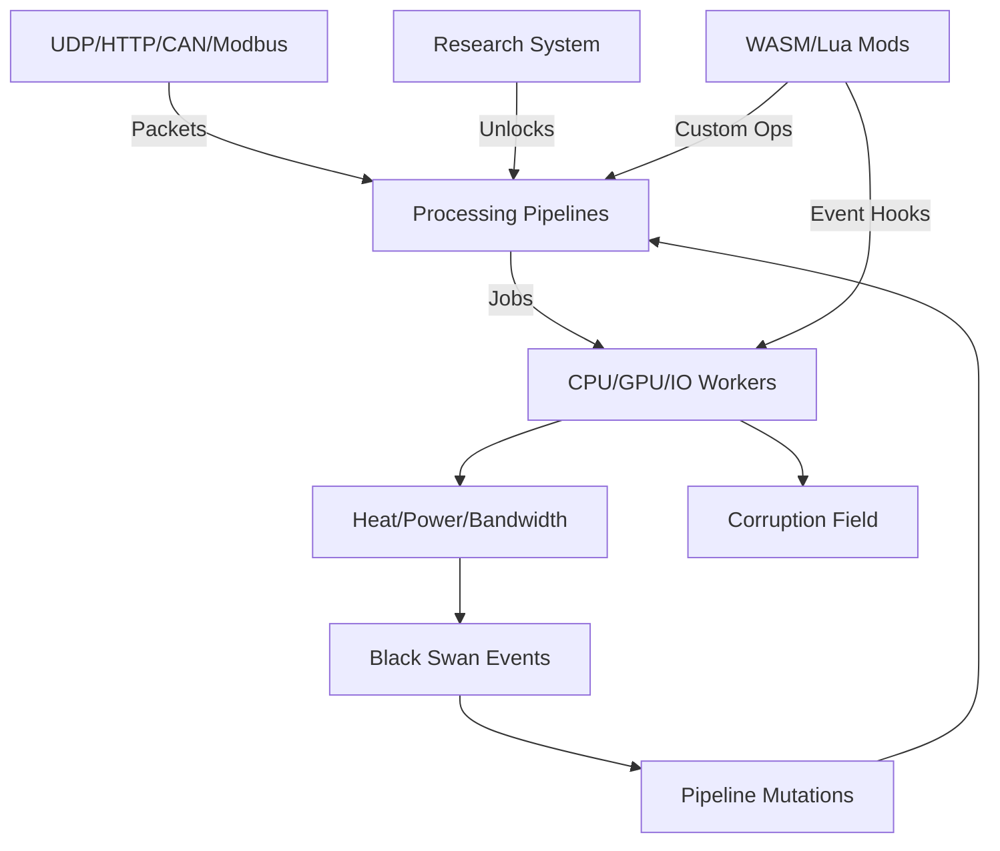

# Asynchronous Colony Simulator

Welcome to the **Asynchronous Colony Simulator** - a comprehensive simulation of computational colonies with advanced modding support, deterministic replay, and real-time performance optimization.

## 🎯 What is Colony Simulator?

The Colony Simulator is a sophisticated simulation engine that models computational colonies - distributed systems of workers processing data through complex pipelines. It combines real-time resource management, fault tolerance, and modding capabilities to create an engaging and educational experience.

### Key Features

- **🏭 Resource Management**: Power, heat, bandwidth, and corruption modeling
- **⚡ GPU Acceleration**: Advanced batching and VRAM management
- **🔄 Fault Tolerance**: Comprehensive fault injection and recovery systems
- **🎲 Black Swans**: Unpredictable events that reshape your colony
- **🔬 Research System**: Technology trees and mutation mechanics
- **🎮 Victory/Loss Conditions**: Strategic gameplay with clear objectives
- **📊 Deterministic Replay**: Debug and analyze with perfect reproducibility
- **🔧 Modding Support**: WASM and Lua scripting with hot reload
- **🛡️ Security**: Sandboxed execution with capability gating

## 🚀 Quick Start

### For Players

1. **Download** the latest release from [GitHub Releases](https://github.com/colony-simulator/colony/releases)
2. **Extract** and run `./colony-desktop` for the graphical interface
3. **Start** with the "First Light Chill" scenario
4. **Learn** the basics in our [Player Manual](player-manual/basics.md)

### For Developers

1. **Clone** the repository: `git clone https://github.com/colony-simulator/colony.git`
2. **Build** with `cargo build --workspace --all-features`
3. **Run** tests with `cargo test --workspace --all-features`
4. **Explore** the [Developer Docs](developer-docs/architecture.md)

### For Modders

1. **Install** the mod CLI: `cargo install colony-mod`
2. **Create** your first mod: `colony-mod new com.example.mymod`
3. **Follow** the [Modding Guide](modding/intro.md)
4. **Test** with `colony-mod validate com.example.mymod`

## 📚 Documentation Structure

### 🎮 Player Manual
- **[Basics](player-manual/basics.md)**: Learn the fundamentals of colony management
- **[Survival Guide](player-manual/survival.md)**: Master resource management and fault recovery
- **[Victory & Loss](player-manual/victory-loss.md)**: Understand win conditions and failure modes

### 👨‍💻 Developer Docs
- **[Architecture](developer-docs/architecture.md)**: System design and ECS architecture
- **[Operations & Pipelines](developer-docs/ops-and-pipelines.md)**: Core processing systems
- **[GPU Yard](developer-docs/gpu-yard.md)**: GPU batching and VRAM management
- **[Corruption & Faults](developer-docs/corruption-faults.md)**: Fault injection and recovery
- **[Research & Rituals](developer-docs/research-rituals.md)**: Technology trees and mutations
- **[Sessions & Replay](developer-docs/sessions-replay.md)**: Save/load and deterministic replay
- **[Verification](developer-docs/verification-m8.md)**: Testing and quality assurance

### 🔧 Modding
- **[Introduction](modding/intro.md)**: Getting started with modding
- **[WASM Operations](modding/wasm-ops.md)**: Creating custom operations
- **[Lua Events](modding/lua-events.md)**: Event-driven scripting
- **[Hot Reload](modding/hot-reload.md)**: Live mod development
- **[Capabilities](modding/capabilities.md)**: Security and permissions
- **[CLI Tools](modding/cli.md)**: Command-line mod management

### 📖 Reference
- **[Rust Crates](reference/rust-crates.md)**: API documentation
- **[WASM ABI](reference/wasm-abi.md)**: WebAssembly interface
- **[Lua API](reference/lua-api.md)**: Lua scripting interface
- **[Configuration](reference/configs.md)**: Configuration files

### 🎯 Guides
- **[First Black Swan](guides/first-black-swan.md)**: Survive your first crisis
- **[Add a New Operation](guides/add-op.md)**: Extend the simulation
- **[Build a Mod](guides/build-mod.md)**: Create your first mod
- **[Test a Mod](guides/test-mod.md)**: Quality assurance for mods

### 🧠 Knowledge Base
- **[Performance Tuning](kb/perf-tuning.md)**: Optimize your colony
- **[Debugging](kb/debugging.md)**: Troubleshoot issues
- **[Deterministic Replay](kb/deterministic-replay.md)**: Analyze with precision
- **[CI & RC Pipeline](kb/ci-rc-pipeline.md)**: Release management

## 🏗️ System Architecture

## 🎮 Gameplay Loop

1. **Setup**: Configure your colony with workers and workyards
2. **Process**: Handle incoming data through processing pipelines
3. **Manage**: Monitor resources, heat, and corruption levels
4. **Research**: Unlock new technologies and capabilities
5. **Adapt**: Respond to Black Swan events and system failures
6. **Victory**: Achieve your colony's objectives or face defeat

## 🔬 Technical Highlights

### Deterministic Simulation
- **Seeded RNG**: Reproducible results with fixed seeds
- **Event Logging**: Complete audit trail of all simulation events
- **Replay System**: Perfect playback of any simulation run
- **Debugging**: Step through any simulation with precision

### Performance Optimization
- **GPU Batching**: 2x throughput improvement through intelligent batching
- **Thermal Management**: Dynamic throttling based on heat levels
- **Resource Pooling**: Efficient memory and CPU utilization
- **Async Processing**: Non-blocking I/O and computation

### Security & Sandboxing
- **WASM Isolation**: Secure execution with fuel and memory limits
- **Lua Sandboxing**: Restricted environment with capability gating
- **Hot Reload Safety**: Atomic updates with rollback capability
- **Content Signing**: Cryptographic verification of mod authenticity

## 🚀 Getting Started

Ready to dive in? Choose your path:

-   :material-rocket-launch:{ .lg .middle } **New to Colony Simulator?**

    ---

    Start with the [Player Manual](player-manual/basics.md) to learn the fundamentals of colony management.

    [:octicons-arrow-right-24: Player Manual](player-manual/basics.md)

-   :material-code-tags:{ .lg .middle } **Want to contribute?**

    ---

    Check out our [Developer Docs](developer-docs/architecture.md) and [Contributing Guide](contributing.md).

    [:octicons-arrow-right-24: Developer Docs](developer-docs/architecture.md)

-   :material-hammer-screwdriver:{ .lg .middle } **Interested in modding?**

    ---

    Explore the [Modding Guide](modding/intro.md) and create your first mod.

    [:octicons-arrow-right-24: Modding Guide](modding/intro.md)

-   :material-book-open-page-variant:{ .lg .middle } **Need help?**

    ---

    Browse our [Knowledge Base](kb/perf-tuning.md) for troubleshooting and optimization tips.

    [:octicons-arrow-right-24: Knowledge Base](kb/perf-tuning.md)

## 📈 Project Status

The Colony Simulator is actively developed with regular releases. Current status:

- **M1-M7**: ✅ Complete - All core features implemented
- **M8**: ✅ Complete - End-to-end verification and release pipeline
- **M9**: 🚧 In Progress - Documentation and knowledge base

## 🤝 Community

- **GitHub**: [colony-simulator/colony](https://github.com/colony-simulator/colony)
- **Discord**: [Join our community](https://discord.gg/colony-simulator)
- **Issues**: [Report bugs or request features](https://github.com/colony-simulator/colony/issues)
- **Discussions**: [Community discussions](https://github.com/colony-simulator/colony/discussions)

## 📄 License

This project is licensed under the MIT License - see the [LICENSE](license.md) file for details.

---

**Welcome to the Colony. Your simulation awaits.** 🏭✨
