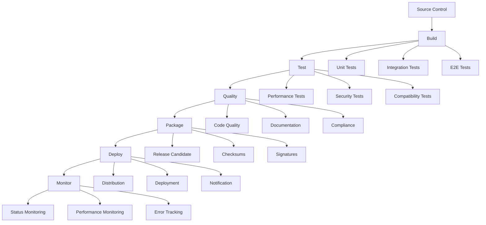

# Knowledge Base: CI & RC Pipeline

This article provides comprehensive guidance on the Continuous Integration (CI) and Release Candidate (RC) pipeline for the Colony Simulator, covering the build process, testing, and release management.

## Overview

The CI & RC pipeline provides:

- **Automated Building**: Automated building of all components
- **Comprehensive Testing**: Automated testing of all functionality
- **Quality Assurance**: Automated quality checks and validation
- **Release Management**: Automated release candidate generation
- **Deployment**: Automated deployment and distribution
- **Monitoring**: Continuous monitoring of build and test status

## Pipeline Architecture

### Pipeline Stages

The pipeline consists of these stages:

1. **Source Control**: Code management and version control
2. **Build**: Compilation and packaging
3. **Test**: Automated testing and validation
4. **Quality**: Quality checks and analysis
5. **Package**: Release candidate packaging
6. **Deploy**: Deployment and distribution
7. **Monitor**: Monitoring and feedback

### Pipeline Components



## Source Control

### Git Workflow

Use Git for source control:

```bash
# Feature branch workflow
git checkout -b feature/new-feature
git add .
git commit -m "Add new feature"
git push origin feature/new-feature

# Create pull request
gh pr create --title "Add new feature" --body "Description of changes"

# Merge after review
git checkout main
git merge feature/new-feature
git push origin main
```

### Branch Protection

Protect main branch:

```yaml
# .github/branch-protection.yml
name: Branch Protection
on:
  push:
    branches: [main]

jobs:
  branch-protection:
    runs-on: ubuntu-latest
    steps:
      - name: Check branch protection
        run: |
          # Check if branch is protected
          if [ "$GITHUB_REF" = "refs/heads/main" ]; then
            echo "Main branch is protected"
          fi
```

### Commit Standards

Follow commit standards:

```bash
# Conventional commits
feat: add new feature
fix: fix bug
docs: update documentation
style: code style changes
refactor: code refactoring
test: add tests
chore: maintenance tasks

# Examples
git commit -m "feat(core): add new operation type"
git commit -m "fix(desktop): resolve UI rendering issue"
git commit -m "docs(api): update WASM ABI documentation"
```

## Build Process

### Build Configuration

Configure build process:

```yaml
# .github/workflows/build.yml
name: Build
on:
  push:
    branches: [main, develop]
  pull_request:
    branches: [main, develop]

jobs:
  build:
    runs-on: ubuntu-latest
    strategy:
      matrix:
        target: [x86_64-unknown-linux-gnu, x86_64-pc-windows-msvc, x86_64-apple-darwin]
    
    steps:
      - name: Checkout code
        uses: actions/checkout@v4
      
      - name: Install Rust
        uses: actions-rs/toolchain@v1
        with:
          toolchain: stable
          components: rustfmt, clippy
      
      - name: Cache cargo registry
        uses: actions/cache@v3
        with:
          path: |
            ~/.cargo/registry
            ~/.cargo/git
            target
          key: ${{ runner.os }}-cargo-${{ hashFiles('**/Cargo.lock') }}
      
      - name: Build project
        run: |
          cargo build --workspace --all-features --target ${{ matrix.target }}
      
      - name: Build WASM modules
        run: |
          wasm-pack build --target web --out-dir pkg
      
      - name: Upload build artifacts
        uses: actions/upload-artifact@v3
        with:
          name: build-${{ matrix.target }}
          path: target/${{ matrix.target }}/release/
```

### Build Optimization

Optimize build process:

```toml
# Cargo.toml
[profile.release]
opt-level = 3
lto = true
codegen-units = 1
panic = "abort"
strip = true

[profile.dev]
opt-level = 0
debug = true
```

### Build Dependencies

Manage build dependencies:

```toml
# Cargo.toml
[build-dependencies]
cc = "1.0"
pkg-config = "0.3"
```

## Testing

### Test Configuration

Configure testing:

```yaml
# .github/workflows/test.yml
name: Test
on:
  push:
    branches: [main, develop]
  pull_request:
    branches: [main, develop]

jobs:
  test:
    runs-on: ubuntu-latest
    steps:
      - name: Checkout code
        uses: actions/checkout@v4
      
      - name: Install Rust
        uses: actions-rs/toolchain@v1
        with:
          toolchain: stable
      
      - name: Run unit tests
        run: |
          cargo test --workspace --all-features
      
      - name: Run integration tests
        run: |
          cargo test --package colony-headless --test integration_tests
      
      - name: Run E2E tests
        run: |
          cargo test --package colony-headless --test e2e_tests
      
      - name: Run performance tests
        run: |
          cargo bench --workspace --all-features
      
      - name: Run security tests
        run: |
          cargo test --package colony-core --test security_tests
```

### Test Categories

Organize tests by category:

```rust
// tests/unit_tests.rs
#[cfg(test)]
mod unit_tests {
    use super::*;
    
    #[test]
    fn test_basic_functionality() {
        // Test basic functionality
    }
    
    #[test]
    fn test_edge_cases() {
        // Test edge cases
    }
}

// tests/integration_tests.rs
#[cfg(test)]
mod integration_tests {
    use super::*;
    
    #[test]
    fn test_component_integration() {
        // Test component integration
    }
    
    #[test]
    fn test_system_integration() {
        // Test system integration
    }
}

// tests/e2e_tests.rs
#[cfg(test)]
mod e2e_tests {
    use super::*;
    
    #[test]
    fn test_complete_workflow() {
        // Test complete workflow
    }
    
    #[test]
    fn test_user_scenarios() {
        // Test user scenarios
    }
}
```

### Test Coverage

Measure test coverage:

```yaml
# .github/workflows/coverage.yml
name: Coverage
on:
  push:
    branches: [main, develop]

jobs:
  coverage:
    runs-on: ubuntu-latest
    steps:
      - name: Checkout code
        uses: actions/checkout@v4
      
      - name: Install Rust
        uses: actions-rs/toolchain@v1
        with:
          toolchain: stable
      
      - name: Install cargo-tarpaulin
        run: |
          cargo install cargo-tarpaulin
      
      - name: Run coverage
        run: |
          cargo tarpaulin --workspace --all-features --out Html
      
      - name: Upload coverage
        uses: actions/upload-artifact@v3
        with:
          name: coverage-report
          path: tarpaulin-report.html
```

## Quality Assurance

### Code Quality

Ensure code quality:

```yaml
# .github/workflows/quality.yml
name: Quality
on:
  push:
    branches: [main, develop]
  pull_request:
    branches: [main, develop]

jobs:
  quality:
    runs-on: ubuntu-latest
    steps:
      - name: Checkout code
        uses: actions/checkout@v4
      
      - name: Install Rust
        uses: actions-rs/toolchain@v1
        with:
          toolchain: stable
          components: rustfmt, clippy
      
      - name: Run rustfmt
        run: |
          cargo fmt --all -- --check
      
      - name: Run clippy
        run: |
          cargo clippy --workspace --all-features -- -D warnings
      
      - name: Run cargo audit
        run: |
          cargo audit
      
      - name: Run cargo deny
        run: |
          cargo deny check
```

### Documentation Quality

Ensure documentation quality:

```yaml
# .github/workflows/docs.yml
name: Documentation
on:
  push:
    branches: [main, develop]
  pull_request:
    branches: [main, develop]

jobs:
  docs:
    runs-on: ubuntu-latest
    steps:
      - name: Checkout code
        uses: actions/checkout@v4
      
      - name: Install Rust
        uses: actions-rs/toolchain@v1
        with:
          toolchain: stable
      
      - name: Build documentation
        run: |
          cargo doc --workspace --all-features --no-deps
      
      - name: Check documentation
        run: |
          cargo doc --workspace --all-features --no-deps --document-private-items
      
      - name: Upload documentation
        uses: actions/upload-artifact@v3
        with:
          name: documentation
          path: target/doc/
```

### Security Quality

Ensure security quality:

```yaml
# .github/workflows/security.yml
name: Security
on:
  push:
    branches: [main, develop]
  pull_request:
    branches: [main, develop]

jobs:
  security:
    runs-on: ubuntu-latest
    steps:
      - name: Checkout code
        uses: actions/checkout@v4
      
      - name: Install Rust
        uses: actions-rs/toolchain@v1
        with:
          toolchain: stable
      
      - name: Run cargo audit
        run: |
          cargo audit
      
      - name: Run cargo deny
        run: |
          cargo deny check
      
      - name: Run security tests
        run: |
          cargo test --package colony-core --test security_tests
```

## Release Candidate Generation

### RC Build Process

Generate release candidates:

```yaml
# .github/workflows/release.yml
name: Release
on:
  push:
    tags:
      - 'v*'

jobs:
  release:
    runs-on: ubuntu-latest
    steps:
      - name: Checkout code
        uses: actions/checkout@v4
      
      - name: Install Rust
        uses: actions-rs/toolchain@v1
        with:
          toolchain: stable
      
      - name: Build release
        run: |
          cargo build --workspace --all-features --release
      
      - name: Run tests
        run: |
          cargo test --workspace --all-features
      
      - name: Generate checksums
        run: |
          find target/release -name "colony-*" -exec sha256sum {} \; > checksums.txt
      
      - name: Sign binaries
        run: |
          gpg --armor --detach-sign checksums.txt
      
      - name: Create release
        uses: actions/create-release@v1
        with:
          tag_name: ${{ github.ref }}
          release_name: Release ${{ github.ref }}
          body: |
            Release ${{ github.ref }}
            
            ## Changes
            - See CHANGELOG.md for details
            
            ## Downloads
            - Linux x86_64: colony-linux-x86_64.tar.gz
            - Windows x86_64: colony-windows-x86_64.zip
            - macOS x86_64: colony-macos-x86_64.tar.gz
            - macOS ARM64: colony-macos-aarch64.tar.gz
            
            ## Verification
            - Checksums: checksums.txt
            - Signature: checksums.txt.asc
          draft: false
          prerelease: false
```

### RC Packaging

Package release candidates:

```bash
#!/bin/bash
# scripts/package-rc.sh

set -e

VERSION=$1
if [ -z "$VERSION" ]; then
    echo "Usage: $0 <version>"
    exit 1
fi

# Create release directory
mkdir -p release/$VERSION
cd release/$VERSION

# Build all targets
cargo build --workspace --all-features --release

# Package Linux x86_64
tar -czf colony-linux-x86_64-$VERSION.tar.gz \
    target/release/colony-* \
    README.md \
    LICENSE \
    CHANGELOG.md

# Package Windows x86_64
zip -r colony-windows-x86_64-$VERSION.zip \
    target/release/colony-*.exe \
    README.md \
    LICENSE \
    CHANGELOG.md

# Package macOS x86_64
tar -czf colony-macos-x86_64-$VERSION.tar.gz \
    target/release/colony-* \
    README.md \
    LICENSE \
    CHANGELOG.md

# Package macOS ARM64
tar -czf colony-macos-aarch64-$VERSION.tar.gz \
    target/release/colony-* \
    README.md \
    LICENSE \
    CHANGELOG.md

# Generate checksums
sha256sum colony-* > checksums.txt

# Sign checksums
gpg --armor --detach-sign checksums.txt

echo "Release candidate $VERSION packaged successfully"
```

### RC Validation

Validate release candidates:

```yaml
# .github/workflows/validate-rc.yml
name: Validate RC
on:
  workflow_dispatch:
    inputs:
      version:
        description: 'Version to validate'
        required: true

jobs:
  validate:
    runs-on: ubuntu-latest
    steps:
      - name: Checkout code
        uses: actions/checkout@v4
      
      - name: Download RC
        run: |
          wget https://github.com/colony-simulator/colony/releases/download/v${{ github.event.inputs.version }}/colony-linux-x86_64-${{ github.event.inputs.version }}.tar.gz
      
      - name: Verify checksums
        run: |
          wget https://github.com/colony-simulator/colony/releases/download/v${{ github.event.inputs.version }}/checksums.txt
          wget https://github.com/colony-simulator/colony/releases/download/v${{ github.event.inputs.version }}/checksums.txt.asc
          gpg --verify checksums.txt.asc checksums.txt
          sha256sum -c checksums.txt
      
      - name: Extract and test
        run: |
          tar -xzf colony-linux-x86_64-${{ github.event.inputs.version }}.tar.gz
          ./colony-desktop --version
          ./colony-headless --version
          ./colony-mod --version
      
      - name: Run smoke tests
        run: |
          ./colony-headless --test-scenario basic
          ./colony-mod validate
```

## Deployment

### Deployment Configuration

Configure deployment:

```yaml
# .github/workflows/deploy.yml
name: Deploy
on:
  push:
    tags:
      - 'v*'

jobs:
  deploy:
    runs-on: ubuntu-latest
    steps:
      - name: Checkout code
        uses: actions/checkout@v4
      
      - name: Deploy to production
        run: |
          # Deploy to production environment
          echo "Deploying to production..."
      
      - name: Deploy to staging
        run: |
          # Deploy to staging environment
          echo "Deploying to staging..."
      
      - name: Deploy documentation
        run: |
          # Deploy documentation
          echo "Deploying documentation..."
```

### Deployment Strategies

Use deployment strategies:

```bash
#!/bin/bash
# scripts/deploy.sh

set -e

ENVIRONMENT=$1
VERSION=$2

if [ -z "$ENVIRONMENT" ] || [ -z "$VERSION" ]; then
    echo "Usage: $0 <environment> <version>"
    exit 1
fi

case $ENVIRONMENT in
    staging)
        echo "Deploying to staging environment..."
        # Deploy to staging
        ;;
    production)
        echo "Deploying to production environment..."
        # Deploy to production
        ;;
    *)
        echo "Unknown environment: $ENVIRONMENT"
        exit 1
        ;;
esac

echo "Deployment completed successfully"
```

## Monitoring

### Build Monitoring

Monitor build status:

```yaml
# .github/workflows/monitor.yml
name: Monitor
on:
  schedule:
    - cron: '0 */6 * * *'  # Every 6 hours

jobs:
  monitor:
    runs-on: ubuntu-latest
    steps:
      - name: Check build status
        run: |
          # Check build status
          echo "Checking build status..."
      
      - name: Check test status
        run: |
          # Check test status
          echo "Checking test status..."
      
      - name: Check deployment status
        run: |
          # Check deployment status
          echo "Checking deployment status..."
      
      - name: Send notifications
        run: |
          # Send notifications if issues found
          echo "Sending notifications..."
```

### Performance Monitoring

Monitor performance:

```yaml
# .github/workflows/performance.yml
name: Performance
on:
  schedule:
    - cron: '0 0 * * *'  # Daily

jobs:
  performance:
    runs-on: ubuntu-latest
    steps:
      - name: Checkout code
        uses: actions/checkout@v4
      
      - name: Run performance tests
        run: |
          cargo bench --workspace --all-features
      
      - name: Analyze performance
        run: |
          # Analyze performance metrics
          echo "Analyzing performance..."
      
      - name: Generate report
        run: |
          # Generate performance report
          echo "Generating performance report..."
```

## Best Practices

### CI/CD Best Practices

1. **Automate Everything**: Automate all build, test, and deployment processes
2. **Fail Fast**: Fail fast on errors to catch issues early
3. **Parallel Execution**: Use parallel execution to speed up builds
4. **Caching**: Use caching to speed up builds
5. **Monitoring**: Monitor all pipeline stages

### Release Management Best Practices

1. **Semantic Versioning**: Use semantic versioning for releases
2. **Release Notes**: Maintain comprehensive release notes
3. **Testing**: Test all release candidates thoroughly
4. **Signing**: Sign all releases for authenticity
5. **Rollback**: Have rollback procedures ready

### Quality Assurance Best Practices

1. **Code Reviews**: Require code reviews for all changes
2. **Automated Testing**: Use automated testing for all functionality
3. **Quality Gates**: Use quality gates to prevent low-quality code
4. **Security Scanning**: Scan for security vulnerabilities
5. **Documentation**: Maintain up-to-date documentation

## Troubleshooting

### Common Issues

1. **Build Failures**: Check dependencies and configuration
2. **Test Failures**: Check test environment and data
3. **Deployment Failures**: Check deployment configuration
4. **Performance Issues**: Check resource usage and optimization
5. **Security Issues**: Check security scanning results

### Debug Techniques

1. **Log Analysis**: Analyze build and test logs
2. **Environment Debugging**: Debug environment issues
3. **Dependency Debugging**: Debug dependency issues
4. **Configuration Debugging**: Debug configuration issues
5. **Performance Debugging**: Debug performance issues

## Conclusion

The CI & RC pipeline is essential for maintaining quality and reliability in the Colony Simulator. By following best practices and using the right tools, you can ensure smooth development and release processes.

Key points to remember:

- **Automate Everything**: Automate all processes
- **Quality First**: Prioritize quality over speed
- **Monitor Continuously**: Monitor all pipeline stages
- **Test Thoroughly**: Test all functionality
- **Document Everything**: Document all processes

---

**A robust CI & RC pipeline is essential for reliable software development.** 🏭🚀
